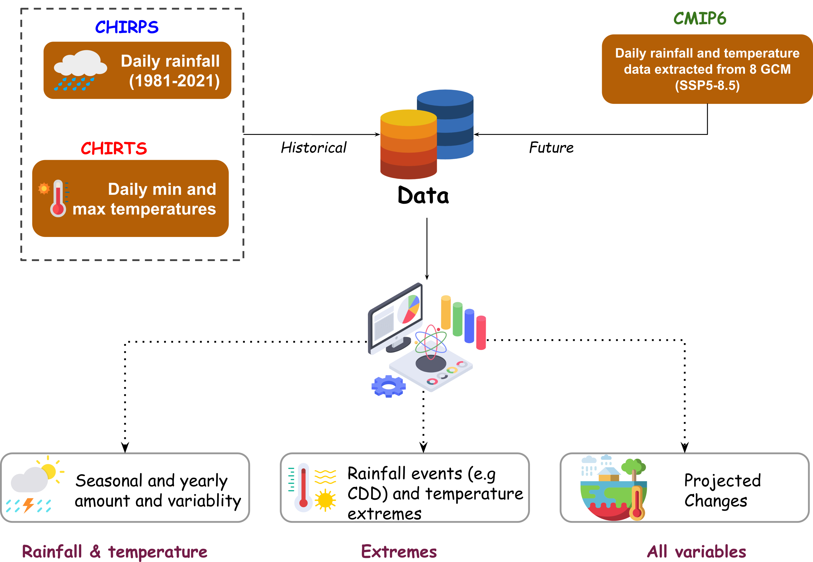

# The Food Systems Resilience Program (FSRP)

 This project is funded by [GCA](https://gca.org/) and implemented by  [Ethiopian Ministry of Agriculture](https://www.govserv.org/ET/Addis-Ababa/407399392712982/Ministry-of-Agriculture---Ethiopia) and other institutions including [CIMMYT](https://www.cimmyt.org/). 

#### -- Project Status: [Active]

## Objective
The purpose of this project is to profile the climate risks to 5 value-chains, provide implications of those risks of the different segments of the every value chain and finally suggest adaptation options. 

### Methods Used
* Vector data processing (reading, writing, intersection, union, etc.)
* Raster data analysis (reading, writing, spatial operations, cropping, zonal statistics, etc.)
* Resampling et pixel reclassification
* Advanced vector and raster Visualization
* etc.

### Technologies
R, Git, RStudio, rgdal, sf, rgeos, terra, tidyverse, tidyterra, ggspatial, RColorBrewer, paletteer, viridis, ggpattern, exactextractr, raster, ggplot2, rayshader, flexdashboard, reactable, plotly, echarts4r, tmap, tmaptools and shiny 

## Contributing Members
Maintener: [Adama Ndour](https://github.com/adamavip)

|Name     |  Contact   | 
|---------|-----------------|
|[Adama Ndour](https://github.com/adamavip)| adama.ndour@cgiar.org        |
|[Gerald B](https://github.com/krithika17) |     adama.ndour@cgiar.org    |

## Contact
Reach out me 

  

